# Fundamentos del desarrollo de videojuegos
### Diego Herrera Mendoza
Físicas

1. Crear una escena simple sobre la que probar diferentes configuraciones de objetos físicos en Unity. Incluye scripts para cada uno de los tipos de objetos: Dinámico, Cinemático, Estático y prográmales eventos OnCollision2D y OnTrigger2D que muestren un mensaje con cada uno de los tipos de evento en consola. Configura adecuadamente el collider y/o Rigidbody, además del evento que corresponda para poder imprimir el mensaje en la consola. En caso de no poderse indicar por qué.

Scripts: [Dinámico](scripts/DynamicObject.cs), [Cinemático](scripts/KinematicObject.cs), [Estático](scripts/StaticObject.cs)

- Ninguno de los objetos será físico.

No se pueden detectar colisiones si los objetos no tienen físicas.

- Un objeto tiene físicas y el otro no.
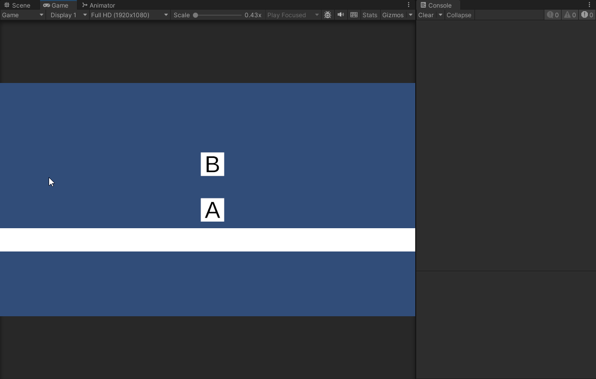

- Ambos objetos tienen físicas.

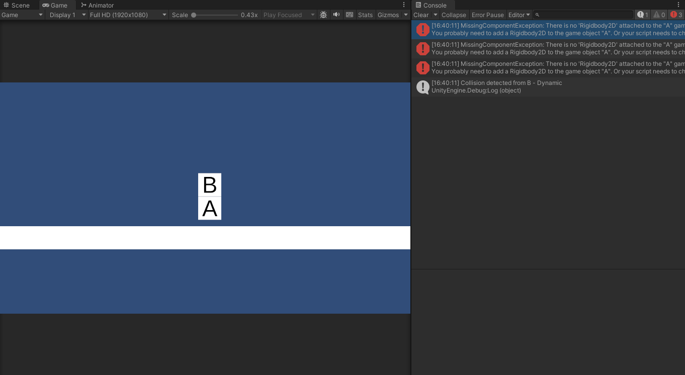

Solo se muestra el escenario en el que el objeto físico es dinámico ya que si es estático o cinemático no se detectan colisiones.

- Ambos objetos tienen físicas y uno de ellos tiene 10 veces más masa que el otro.

Dinámico y dinámico
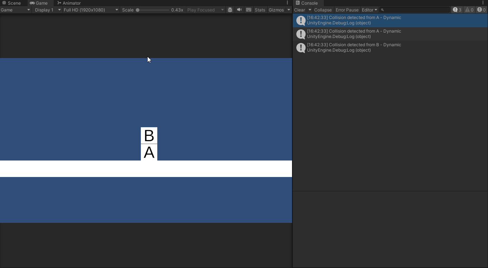

Dinámico y estático
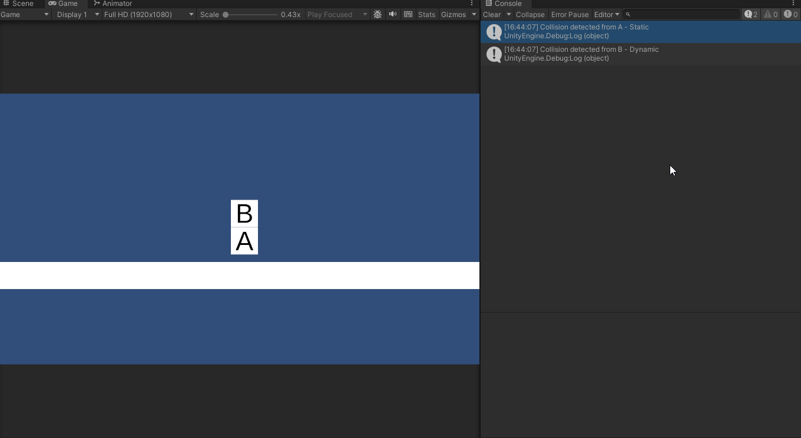

Dinámico y cinemático
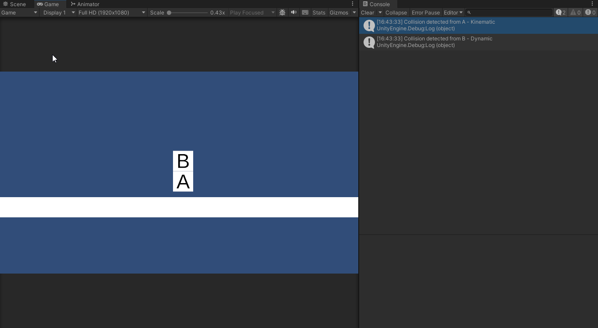

Las demás combinaciones no se muestran ya que no se detectan colisiones.

- Un objeto tiene físicas y el otro es IsTrigger.

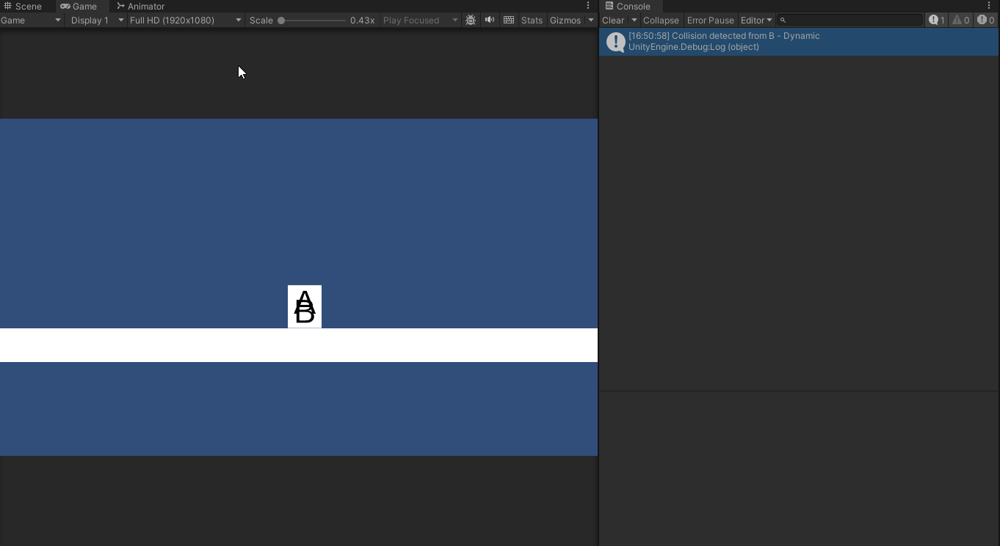

- Ambos objetos son físicos y uno de ellos está marcado como IsTrigger.

Dinámico y dinámico
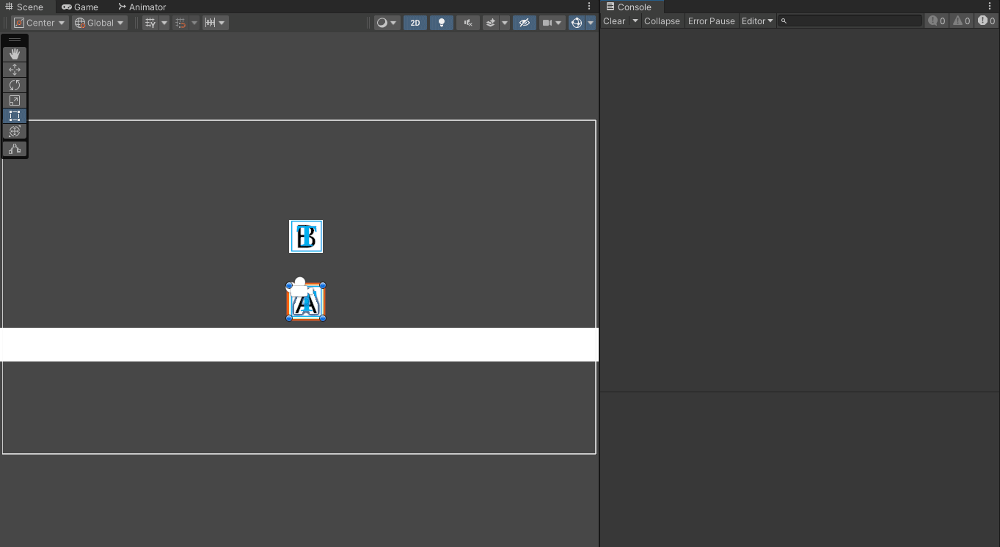

Dinámico y cinemático
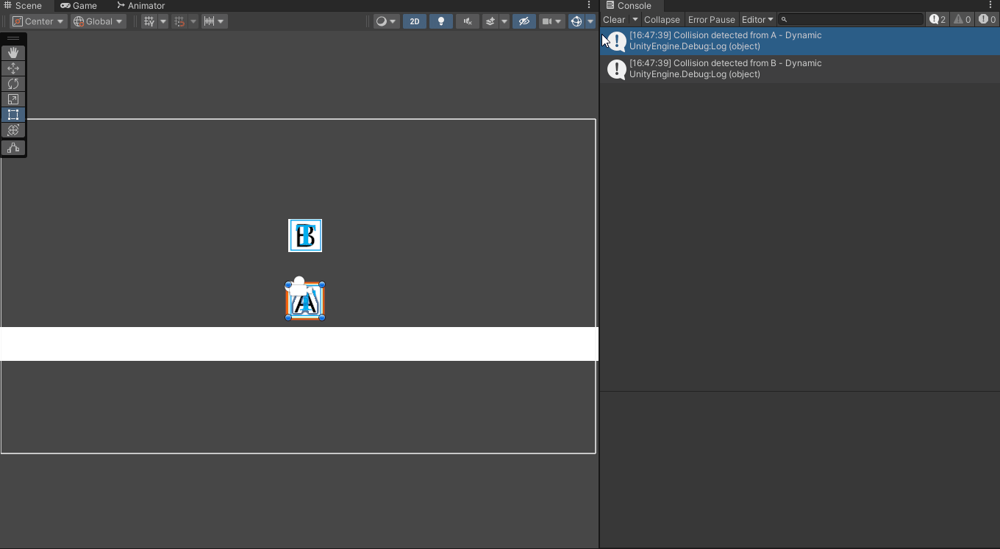

Las demás combinaciones no se muestran ya que no se detectan colisiones o son iguales a las anteriores.

---
2. Incorpora elementos físicos en tu escena que respondan a las siguientes restricciones:

- Objeto estático que ejerce de barrera infranqueable

Todos los ejemplos del punto 1 presentan una barrera infranqueable a modo de suelo. Es simplemente un objeto con un collider y sin físicas.

- Zona en la que los objetos que caen en ella son impulsados hacia adelante

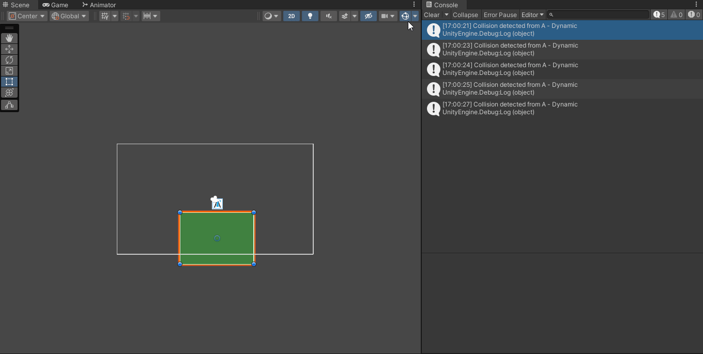

Script: [UpZone](scripts/UpZone.cs)

- Objeto que es arrastrado por otro a una distancia fija

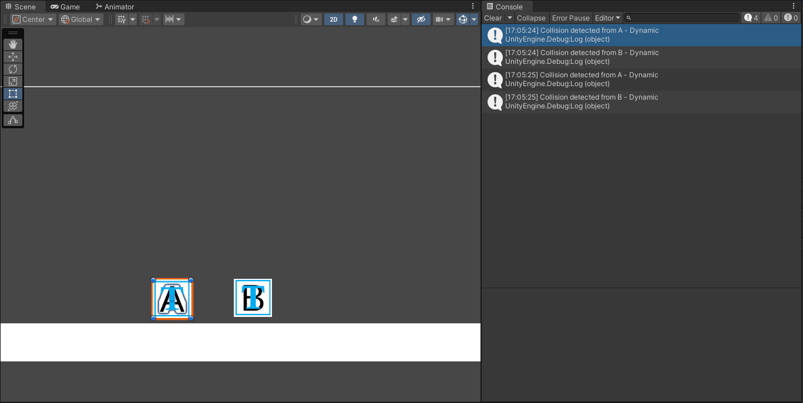

Script: [ConstantXMovement](scripts/ConstantXMovement.cs)

- Objeto que al colisionar con otros sigue un comportamiento totalmente físico.

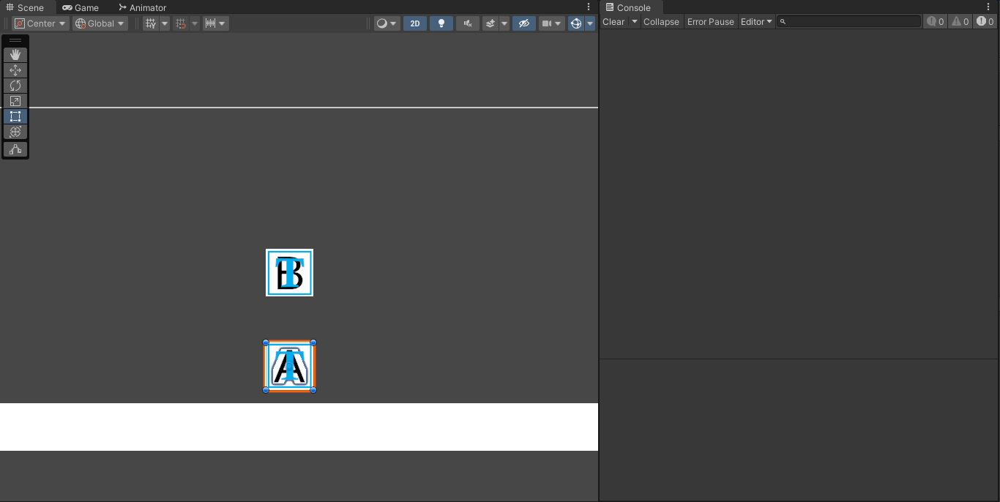

Script: [ActivateSimulation](scripts/ActivateSimulation.cs)

- Incluye dos capas que asignes a diferentes tipos de objetos y que permita evitar colisiones entre ellos.

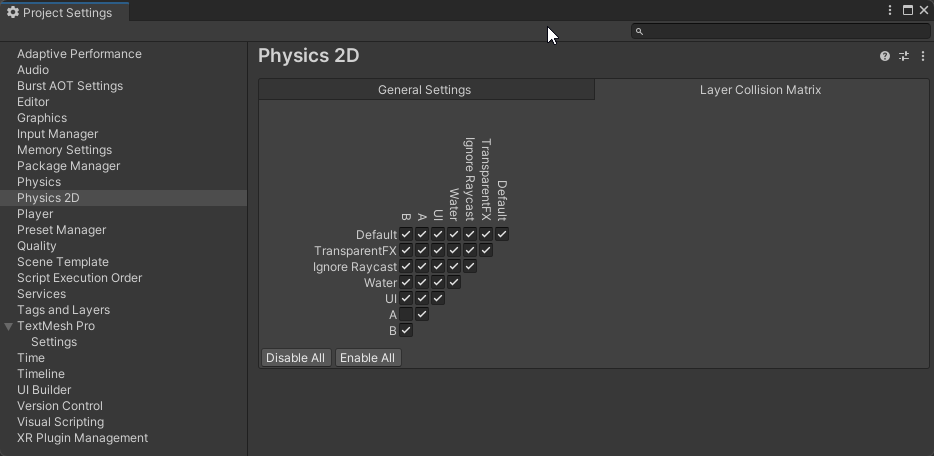

---

3. Partiendo de la escena implementada para la tarea de Sprites construiremos un mapa de juego, que delimitará la zona en la que tendrá lugar la acción. Utiliza los recursos en el paquete generado para la práctica. Debes crear una paleta con los Tiles que consideres. Ajusta el tamaño de los Tiles al tamaño de celda del grid y subdivide aquellos Tiles que ocupen un grupo de celdas. Generar un mapa convencional que represente el entorno y límites de juego.

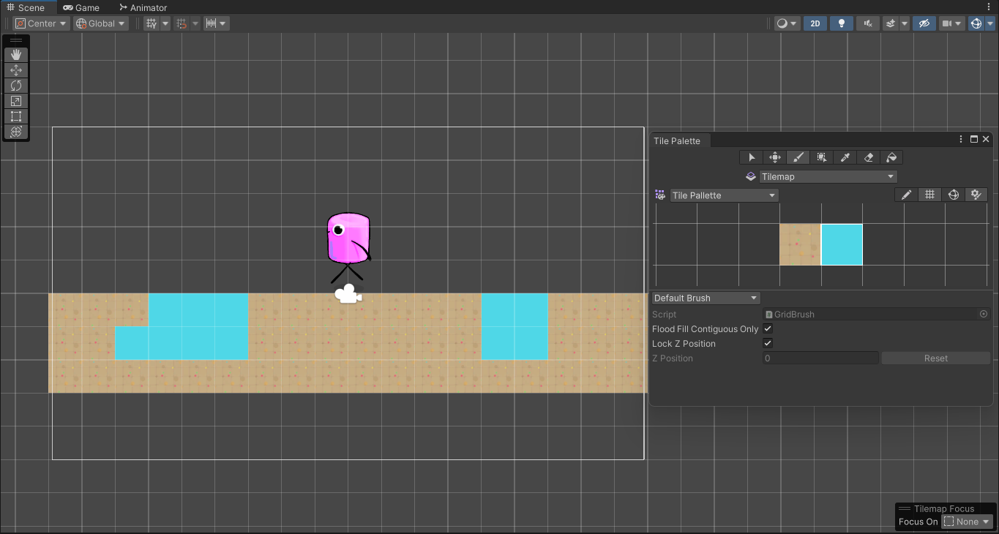

4. Actividades
- Crea dos Tilemaps adicionales de obstáculos. Uno puede representar elementos decorativos y otro obstáculos.
- Agrega a la capa de obstáculos la configuración necesaria para que el Tilemap se construya de forma independiente y el obstáculo actúe como tal.

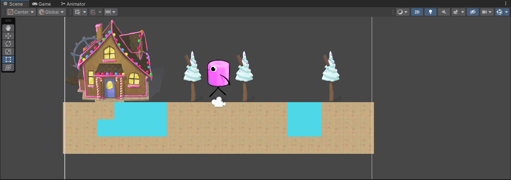

---

5. Actividades
- Control del personaje basado en físicas
- Salto
- Salto a una plataforma
- Plataformas invisibles que se vuelven visibles
- Mecánica de recolección

Scripts: [PlayerMovement](scripts/PlayerMovement.cs), [PointToPoint](scripts/PointToPoint.cs) , [Collectable](scripts/Collectable.cs), [MakeInvisible](scripts/MakeInvisible.cs)

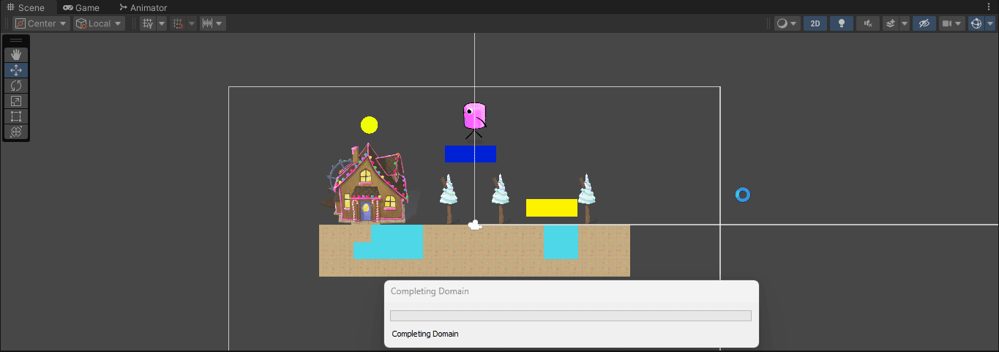

---

